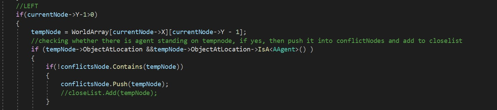

<div id="top"></div>
<!--
*** Thanks for checking out the Best-README-Template. If you have a suggestion
*** that would make this better, please fork the repo and create a pull request
*** or simply open an issue with the tag "enhancement".
*** Don't forget to give the project a star!
*** Thanks again! Now go create something AMAZING! :D
-->


<!-- PROJECT SHIELDS -->
<!--
*** I'm using markdown "reference style" links for readability.
*** Reference links are enclosed in brackets [ ] instead of parentheses ( ).
*** See the bottom of this document for the declaration of the reference variables
*** for contributors-url, forks-url, etc. This is an optional, concise syntax you may use.
*** https://www.markdownguide.org/basic-syntax/#reference-style-links
-->
[![Contributors][contributors-shield]][contributors-url]
[![Forks][forks-shield]][forks-url]
[![Stargazers][stars-shield]][stars-url]
[![Issues][issues-shield]][issues-url]
[![MIT License][license-shield]][license-url]
[![LinkedIn][linkedin-shield]][linkedin-url]


<!-- PROJECT LOGO -->
<br />
<div align="center">
  <a href="https://github.com/pt4300/Multi-Agent-A-Star-Path-Finding">
    
  </a>

<h3 align="center">Multi-Agent A Star Path Finding</h3>

  <p align="center">
    This project use A* algorithm to implement a multi-agent pathfinding mechanism that allows agents eating food to restore health inside a virtual world with avoidance of collision with other agents. UE4 is used as the presenting platform for visualise the algorithm performance.
    <br />
    <a href="https://github.com/pt4300/Multi-Agent-A-Star-Path-Finding"><strong>Explore the docs »</strong></a>
    <br />
    <br />
    <a href="https://github.com/pt4300/Multi-Agent-A-Star-Path-Finding/issues">Report Bug</a>
    ·
    <a href="https://github.com/pt4300/Multi-Agent-A-Star-Path-Finding/issues">Request Feature</a>
  </p>
</div>


<!-- TABLE OF CONTENTS -->
<details>
  <summary>Table of Contents</summary>
  <ol>
    <li>
      <a href="#about-the-project">About The Project</a>
      <ul>
        <li><a href="#built-with">Built With</a></li>
      </ul>
    </li>
    <li>
      <a href="#getting-started">Getting Started</a>
      <ul>
        <li><a href="#prerequisites">Prerequisites</a></li>
        <li><a href="#installation">Installation</a></li>
      </ul>
    </li>
    <li><a href="#usage">Usage</a></li>
    <li><a href="#contributing">Contributing</a></li>
    <li><a href="#license">License</a></li>
    <li><a href="#contact">Contact</a></li>
    <li><a href="#acknowledgments">Acknowledgments</a></li>
  </ol>
</details>


<!-- ABOUT THE PROJECT -->
## About The Project

[![Product Name Screen Shot][product-screenshot]](https://example.com)

The project implements a virtual world consist of two types of agent herbivore and meat. Each agent uses A star algorithm to find their corresponding types of food and avoid collision between wall and other agent. Detail structure of the algorithm will be discuss in usage section.

<p align="right">(<a href="#top">back to top</a>)</p>


### Built With

* [![cpp][cpp]][cpp-url]
* [![unreal][unreal]][unreal-url]


<p align="right">(<a href="#top">back to top</a>)</p>


<!-- GETTING STARTED -->

## Getting Started

This is an example of how you may give instructions on setting up your project locally.
To get a local copy up and running follow these simple example steps.

### Prerequisites

This is an example of how to list things you need to use the software and how to install them.

Unreal Engine 4.24.3
Visual Studio 2017(Recommended)

### Installation

1. Download [Visual Studio](https://visualstudio.microsoft.com/downloads/) and [Unreal Engine](https://www.epicgames.com/id/login?lang=en-US&noHostRedirect=true&redirectUrl=https%3A%2F%2Fstore.epicgames.com%2Fen-US%2Fdownload&client_id=875a3b57d3a640a6b7f9b4e883463ab4&prompt=pass_through)
2. Clone the repo
   ```sh
   git clone https://github.com/pt4300/Multi-Agent-A-Star-Path-Finding.git
   ```
3. Double click uproject file
3. Click Run once the unreal engine is loaded


<p align="right">(<a href="#top">back to top</a>)</p>


<!-- USAGE EXAMPLES -->
## Usage

1. The algorithm was implement based on traditional A Star approach with additional collision detection in their path generation process.
The checking method consume additional computation power during path planning and thus there is limitation on numbers of agents to act simultaneously.
<figure>

 <figcaption>Collision Detection</figcaption>
</figure>

2. This project act as a prototype for future application on multi-agent path finding.

<p align="right">(<a href="#top">back to top</a>)</p>


<!-- CONTRIBUTING -->
## Contributing

Contributions are what make the open source community such an amazing place to learn, inspire, and create. Any contributions you make are **greatly appreciated**.

If you have a suggestion that would make this better, please fork the repo and create a pull request. You can also simply open an issue with the tag "enhancement".
Don't forget to give the project a star! Thanks again!

1. Fork the Project
2. Create your Feature Branch (`git checkout -b feature/AmazingFeature`)
3. Commit your Changes (`git commit -m 'Add some AmazingFeature'`)
4. Push to the Branch (`git push origin feature/AmazingFeature`)
5. Open a Pull Request

<p align="right">(<a href="#top">back to top</a>)</p>


<!-- LICENSE -->
## License

Distributed under the MIT License. See `LICENSE.txt` for more information.

<p align="right">(<a href="#top">back to top</a>)</p>


<!-- CONTACT -->
## Contact

Project Link: [https://github.com/pt4300/Multi-Agent-A-Star-Path-Finding](https://github.com/pt4300/Multi-Agent-A-Star-Path-Finding)

<p align="right">(<a href="#top">back to top</a>)</p>


<!-- MARKDOWN LINKS & IMAGES -->
<!-- https://www.markdownguide.org/basic-syntax/#reference-style-links -->
[contributors-shield]: https://img.shields.io/github/contributors/pt4300/Multi-Agent-A-Star-Path-Finding.svg?style=for-the-badge
[contributors-url]: https://github.com/pt4300/Multi-Agent-A-Star-Path-Finding/graphs/contributors
[forks-shield]: https://img.shields.io/github/forks/pt4300/Multi-Agent-A-Star-Path-Finding.svg?style=for-the-badge
[forks-url]: https://github.com/pt4300/Multi-Agent-A-Star-Path-Finding/network/members
[stars-shield]: https://img.shields.io/github/stars/pt4300/Multi-Agent-A-Star-Path-Finding.svg?style=for-the-badge
[stars-url]: https://github.com/pt4300/Multi-Agent-A-Star-Path-Finding/stargazers
[issues-shield]: https://img.shields.io/github/issues/pt4300/Multi-Agent-A-Star-Path-Finding.svg?style=for-the-badge
[issues-url]: https://github.com/pt4300/Multi-Agent-A-Star-Path-Finding/issues
[license-shield]: https://img.shields.io/github/license/pt4300/Multi-Agent-A-Star-Path-Finding.svg?style=for-the-badge
[license-url]: https://github.com/pt4300/Multi-Agent-A-Star-Path-Finding/blob/master/LICENSE.txt
[linkedin-shield]: https://img.shields.io/badge/-LinkedIn-black.svg?style=for-the-badge&logo=linkedin&colorB=555
[linkedin-url]: https://linkedin.com/in/yuting-yu-5a34031b5
[product-screenshot]: images/initial.jpg
[cpp]: https://img.shields.io/badge/c++-000000?style=for-the-badge
[cpp-url]: https://nextjs.org/
[unreal]: https://img.shields.io/badge/unreal-20232A?style=for-the-badge
[unreal-url]: https://reactjs.org/
